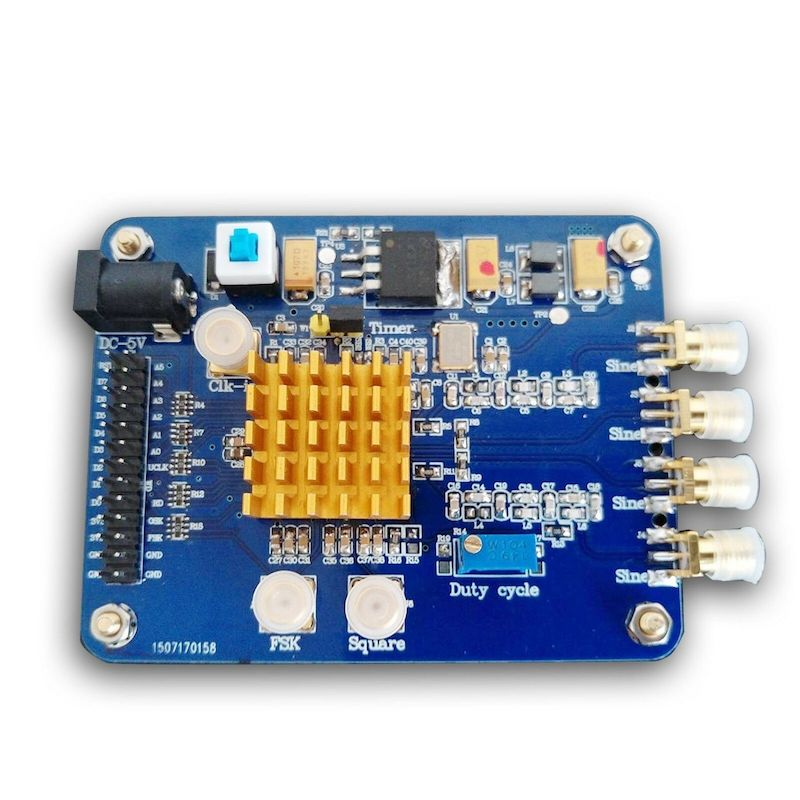
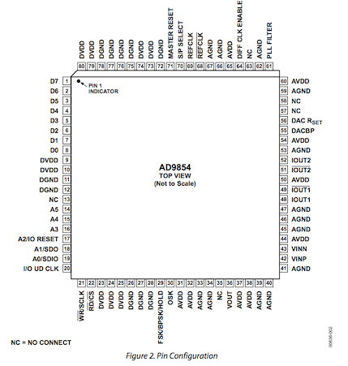
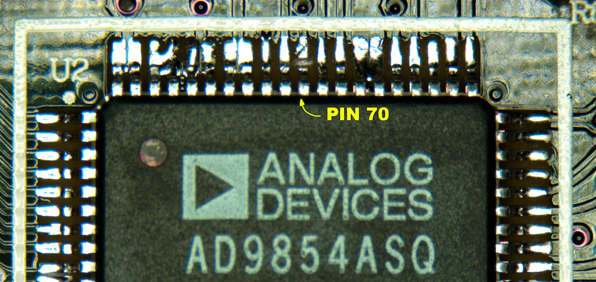
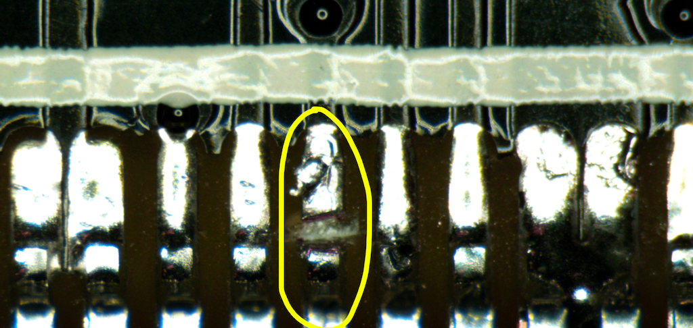
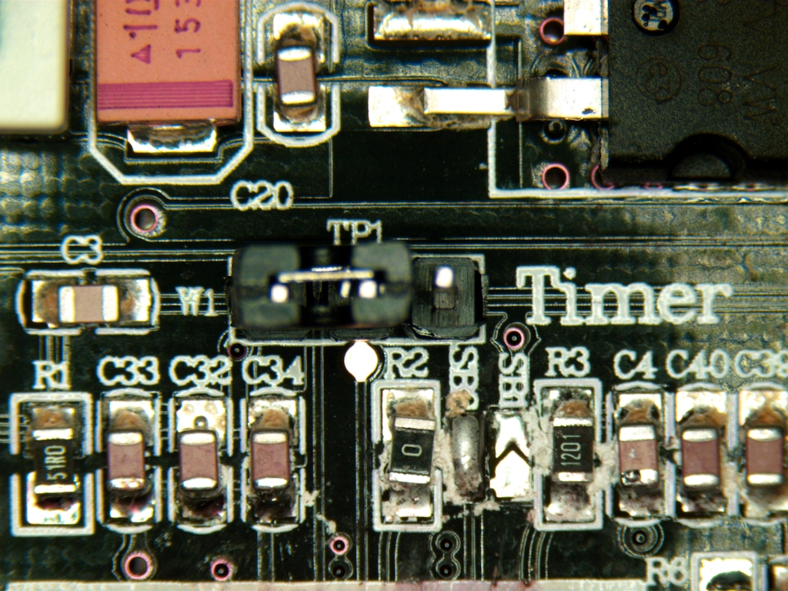
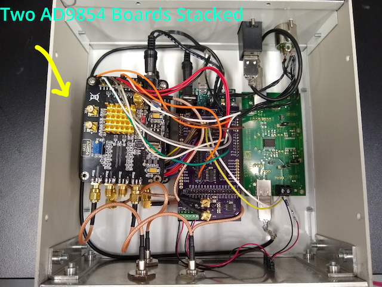

# AC Box based on dual [AD9854](https://www.analog.com/media/en/technical-documentation/data-sheets/AD9854.pdf)

## Part List
| PART                             | SUPPIER     | PART #              | PRICE   | QTY       | SUBTOTAL    |
|:---------------------------------|:------------|:--------------------|:--------|:----------|:------------|
| AD9854 Eval board                | Ebay/Amazon | -                   | $41.76  | 2         | $83.52      |
| ADUM4160 USB isolator            | Digikey     | EVAL-ADUM4160EBZ-ND | $62.50  | 1         | $62.50      |
| 3.3V Voltage Regulator           | Digikey     | LT1587CT-3.3#PBF-ND | $6.16   | 1         | $6.16       |
| SN74HC174 Flip Flop              | Digikey     | 296-1195-1-ND       | $0.47   | 1         | $0.47       |
| Delay Line                       | Digikey     | DS1100Z-200+-ND     | $4.76   | 1         | $4.76       |
| Oscillator 20.00MHz              | Digikey     | 535-12045-1-ND      | $3.34   | 1         | $3.34       |
| Straight Jack Receptacle         | Digikey     | J613-ND             | $2.17   | 2         | $4.34       |
| 2 position .100" terminal block  | Digikey     | A98333-ND           | $0.87   | 5         | $4.35       |
| Straight header                  | Digikey     | S1012EC-40-ND       | $0.56   | 1         | $0.56       |
| Enclosure                        | Digikey     | 377-1238-ND         | $81.00  | 1         | $81.00      |
| Switchcraft D3M                  | Digikey     | SC1010-ND           | $6.72   | 1         | $6.72       |
| Switchcraft A3F                  | Digikey     | SC1001-ND           | $4.40   | 1         | $4.40       |
| 2.1mm center-positive plug cable | Digikey     | CP-2185-ND          | $2.05   | 1         | $2.05       |
| Ribbon Cable                     | Digikey     | H3AAH-4006G-ND      | $1.88   | 2         | $3.76       |
| 6" SMB/SMB cable                 | Digikey     | J7306-ND            | $21.66  | 2         | $43.32      |
| 6" BNC/SMB bulkhead cable        | Amazon      | -                   | $6.00   | 4         | $24.00      |
| Arduino Due                      | Amazon      | -                   | $27.99  | 1         | $27.99      |
| 6" USB-A to USB-Micro B cable    | Amazon      | -                   | $1.99   | 1         | $1.99       |
| 6' USB-A to USB B cable          | Amazon      | -                   | $6.49   | 1         | $6.49       |
| USB-A to USB-B feedthrough       | L-com       | ECF504-UAB          | $6.44   | 1         | $6.44       |
| 10V power supply                 | Acopian     | B10G200             | $195.00 | 1         | $195.00     |
| Arduino shield                   | OSHPark     | -                   | $46.25  | 1/3       | $15.46      |
|                                  |             |                     |         | **Total** | **$588.62** |

**OSHParK** [board link](https://oshpark.com/shared_projects/UQsKJloo)

## Assembly instructions

### 1. Prepare the AD9854 Board

The original evaluation board from analog devices is no longer sold, instead we buy boards from amazon or ebay, that could be found by searching for ad9854. The boards look like this:
 

to use this board you first need to make sure that **pin 70** "S/P Select" is set to serial programming mode (**LOW**),
 

 
To do this, take off the heatsink and expose the AD9854 chip (left), using a razor blade break the pin (right)

	
	

Set the Timer **W1 Jumper** into the left most position:
 

 
Finally, reapply thermal paste to the chip and reinstall the heatsink.

### 2. Solder the Arduino Shield
**OSHParK** [board link](https://oshpark.com/shared_projects/UQsKJloo)

Now solder headers, screw terminals, Jack Receptacle, resistors, capacitors, the voltage regulator, the flip flop, the xtal to the DCBOX Arduino shield (see below). You can ensure a good fit to the Arduino if you solder the headers with the shield in place, just make sure not to overheat the Arduino (be quick and minimize soldering iron heat).

	
	

### Assembled ACBox

